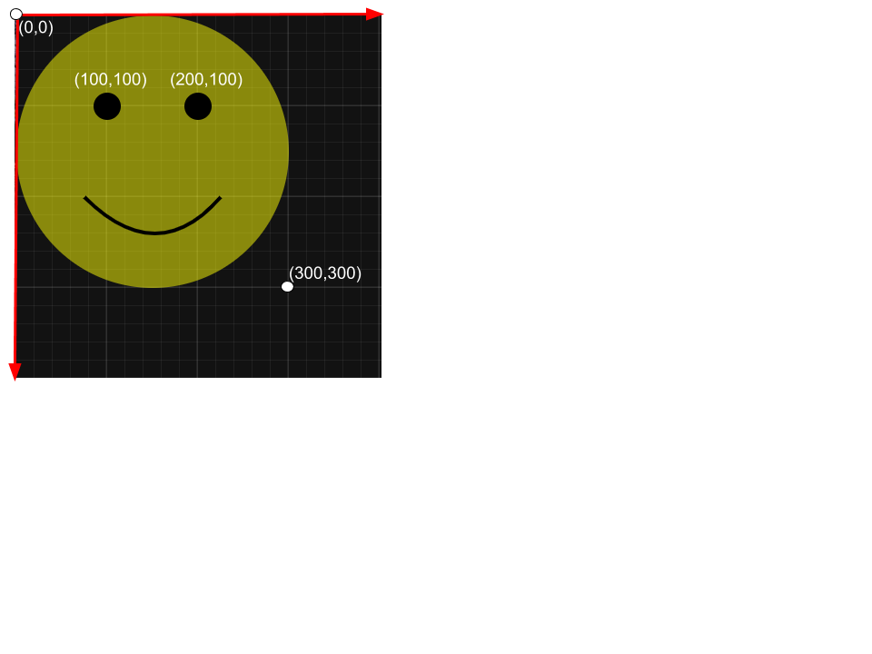

## What is SVG?

SVG stands for Scalable Vector Graphics.

A SVG file is a vector image file format. Vector Graphics are based on mathematical formulas that define geometric primitives such as polygons, lines, curves, circles and rectangles.

Being “Scalable” means that the viewer can scale the SVG image up and down in size without loss of quality. This is possible because the graphics are defined as numbers instead of pixels.

PNG, GIF, and JPG are raster formats. Raster files are made of pixels, or single points of colour. They appear blurry when scaled upwards and on higher resolution screens.


## How to include a SVG element ?

You can embed an SVG image in an HTML file in severals ways:

- Using an img element

  ```
  
  ```

- Using a svg element

  ```
   <body>
        <svg>
          ….
        </svg>
   </body>
  ```

- Using the SVG image as the background image(via CSS)

  ```
   div {
     background-image: url(smile.svg’);
     background-size: 100px 100px;
   }
  ```

## How to create a SVG element?

First, it’s important to understand the Viewport Coordinate System. In the SVG coordinate system the point x= 0 , y= 0 is the upper left corner. As “y” increases in SVG, the points, shapes move down.



### 1. Creating our first SVG element

The first step is to use the `<svg>` element. The svg element is a container that defines a new coordinate system and viewport. The viewport is the visible area of the SVG image. You specify the size of the viewport using the width and height attributes of the svg element. If you do not specify any units inside the width and height attributes, the units are assumed to be pixels.

```
<svg xlmns=”http://www.w3.org/2000/svg”   height="300" width="300" viewBox=”0 0 300 300”>

</svg>
```

The svg has the following attributes:

- `xmlns`: It’s only required on the outermost svg element of SVG documents. Specifying SVG Namespace , we need to tell the browser that we are going to be using a different version of XML, with non-HTML tags..

- `height`: The displayed height of the rectangular viewport.

- `width`: The displayed width of the rectangular viewport.

### 2. Drawing our first circle

SVG has some predefined shape elements. The `<circle>` tag allows us to draw circles on our SVG canvas.

```
<circle cx="150" cy="150" r="150" fill="hsla(60,100%,50%, 0.5)" id="bigCircle" class="circle"/>
```

The `cx` and `cy` attributes define the x and y coordinates of the center of the circle. If `cx` and `cy` are omitted, the circle’s center is set to (0,0).
The `r` attribute defines the radius of the circle.

### 3. Adding a second and third circle

We will create a second and third circle, but those will have a black background.

```
<circle cx="100" cy="100" r="15" fill="black"/>
<circle cx="200" cy="100" r="15" fill="black"/>
```

### 4. Adding a path

Finally, we are going to make the mouth of our face with a path

```
<path d="M 75 200 q 80 80 150 0" stroke="black" stroke-width="4" fill="none" />
```

Here is finally our svg element:

```
<svg  height="300" width="300" >
   <circle cx="150" cy="150" r="150" fill="hsla(60,100%,50%, 0.5)" id="bigCircle" class="circle"/>
    <circle cx="100" cy="100" r="15" fill="black"/>
    <circle cx="200" cy="100" r="15" fill="black"/>
   <path d="M 75 200 q 80 80 150 0" stroke="black"  stroke-width="4" fill="none"  />
</svg>
```
