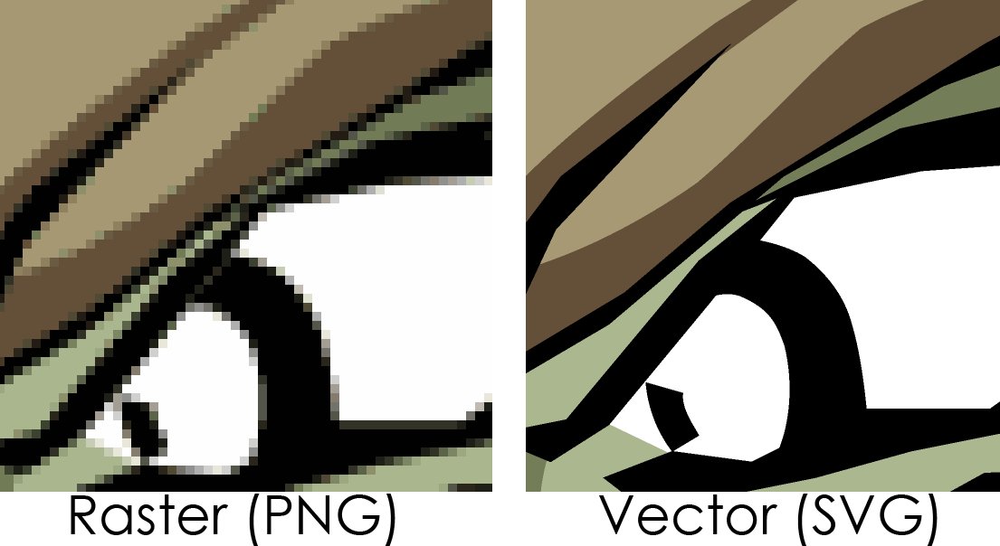

## Que es SVG?

SVG significa Gráficos vectoriales escalables.

Un archivo SVG es un formato de archivo de imagen vectorial. Los gráficos vectoriales estan basados en formúlas matématicas que definen figuras geométricas tales como polígonos, líneas, curvas, círculos y rectángulos.

Ser "escalable" signica que el usuario puede escalar la imagen SVG, aumentando y disminuyendo su tamaño sin perder la calidad. Esto es posible porque los gráficos están definidos como números en lugar de pixeles.

PNG, GIF, and JPG son formatos raster. Los archivos raster están hechos de pixeles, o puntos únicos de color, estos aparecen borrosos cuando se escala hacia arriba y en pantallas de mayor resolución.



## Como incluir un elemento SVG?

Podemos incluir una imagen SVG en un archivo HTML de varias maneras:

- Usando un elemento img

  ```
  
  ```

- Usando un elemento svg

  ```
   <body>
        <svg>
          ….
        </svg>
   </body>
  ```

- Usando la imagen SVG como imagen de fondo a través de CSS

  ```
   div {
     background-image: url(happy.svg’);
     background-size: 100px 100px;
   }
  ```

## Como crear un elemento SVG?

Para conocer como crear un elemento SVG, vamos a crear una sencilla carita feliz, pero primero es importante comprender el sistema de coordenadas.

En el sistema de coordenadas de SVG el punto x= 0, y= 0 esta en la esquina superior izquierda. A medida que "y" aumenta en SVG, los puntos y las figuras se mueven hacia abajo.

<svg height="400" width="400" class="svg-coordinates">
<svg  height="300" width="300" >

   <circle cx="150" cy="150" r="150" fill="yellow" fill-opacity="0.6" />
    <circle cx="100" cy="100" r="15" fill="black"/>
   <circle cx="200" cy="100" r="15" fill="black"/>
   <path d="M 75 200 Q 150 260 225 200" stroke="black"  stroke-width="4" fill="none"/>
 <text x="100" y="100" fill="white" class="heavy">(100,100)</text>
    <text x="200" y="100" fill="white" class="heavy">(200,100)</text>
</svg>

 <path d="M 0 0 L 350 0" stroke="red" stroke-width="8" />

 <path d="M 0 0 L 0 350" stroke="red" stroke-width="8" />
  
   <text x="5" y="20" fill="white" class="heavy">(0,0)</text>
  <text x="300" y="300" fill="white" class="heavy">(300,300)</text>
   <text x="0" y="370" fill="red" class="heavy">Y</text>
  <text x="370" y="15" fill="red" class="heavy">X</text>
  
</svg>

### 1. Creando nuestro primer elemento SVG

El primer paso es usar el elemento `<svg>`. El elemento `<svg>` es un contenedor que define un nuevo sistema de coordenadas y viewport. El viewport es el area visible de la imagen SVG. Tu puedes especificar el tamaño del viewport usando los atributos `width` and `height` del elemento svg. Si no especificas ninguna unidad dentro de estos atributos, se supone que las unidades son píxeles.

```
<svg xlmns=”http://www.w3.org/2000/svg”   height="300" width="300" viewBox=”0 0 300 300”>

</svg>
```

El svg tiene los siguientes atributos:

- `xmlns`: Solo se requiere en el elemento svg más externo de los documentos SVG. Al especificar el SVG Name Space, debemos decirle al navegador que vamos a utilizar una versión diferente de XML, con etiquetas que no son HTML.

- `height`: La altura visualizada de la ventana gráfica.

- `width`: El ancho visualizado de la ventana gráfica.

### 2. Dibujando nuestro primer círculo

SVG tiene algunos elementos de forma predefinidos. La etiqueta `<circle>` nos permite dibujar círculos en nuestro lienzo SVG.

```
<circle cx="150" cy="150" r="150" fill="yellow" />
```

Los atributos `cx` y `cy` definen las coordenadas "x" y "y" del centro del círculo. Si `cx` y `cy` son omitidos, el centro del círculo se establece en (0,0).

El atributo `r` define el radio de el círculo.

El atributo `fill` define el color de la forma dentro de su contorno.

### 3. Adiccionando un segundo y tercer círculo.

De la misma forma, vamos a crear un segundo y tercero círculo más pequeños, pero estos tendrán un fondo negro.

```
<circle cx="100" cy="100" r="15" fill="black"/>
<circle cx="200" cy="100" r="15" fill="black"/>
```

### 4. Agregando una "path"

Finalmente, vamos hacer la boca de nuestra carita feliz con una `<path>`. El elemento `<path>` puede ser usado para crear líneas, curvas, arcos y más.

La forma de un elemento `<path>` es definido por un parametro `d`. El atributo `d` contiene una serie de comandos y parámetros usados por esos comandos. En nuestro ejemplo vamos a usar los siguientes comandos:

- `M` (Move to): El comando "Mover a" aparece al comienzo de todas las paths para especificar donde debe comenzar el dibujo. Se necesitan dos parámetros, una coordenada (x) y una coordenada (y) para moverse.

- `Q` (Quadratic bezier curve): La curva cuadrática llamada con Q, toma dos parámetros: el punto de control y el punto final de la curva.

Todos los comandos vienen en dos variantes. Una letra mayúscula especifica coordenadas absolutas en la página, y una letra minúscula especifica coordenadas relativas.

El siguiente ejemplo crea una curva, donde el punto de inicio es (75,200), el punto de control es (150,260) y el punto final es (225,200).

```
 <path d="M 75 200 Q 150 260 225 200" stroke="black"  stroke-width="4" fill="none"/>

```

La propiedad `stroke` define el color de la línea.
La propiedad `stroke-width` define el grosor de la línea.

Aquí esta finalmente nuestro elemento SVG:

```
<svg  height="300" width="300" >
   <circle cx="150" cy="150" r="150" fill="yellow" fill-opacity="0.3"/>
    <circle cx="100" cy="100" r="15" fill="black"/>
   <circle cx="200" cy="100" r="15" fill="black"/>
   <path d="M 75 200 Q 150 260 225 200" stroke="black"  stroke-width="4" fill="none"/>
</svg>

```
