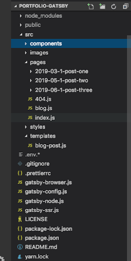

Investigando sobre como crear mi blog, encontré que muchas personas estaban utilizando una herramienta llamada Gatsby.

Gatsby es un framework libre y de código abierto basado en React que ayuda a los desarrolladores a construir sitios web y aplicaciones increíblementes rápidas.

Gatsby sigue los últimos estándares web, y esta optimizado para ser altamente eficiente. Hace uso de las últimas tecnologías incluyendo ReactJS, Webpack, GraphQL, ES6+ JavaScript y CSS.

Esta es una guía de como crear un blog usando Gatsby. Asegurate de tener Node.js instalado y actualizado.

## Paso 1: Crear el proyecto con gatsby

Abre tu terminal e ingresa:

`npx gatsby new [NOMBRE_DEL_DIRECTORIO_DEL_SITIO][url_repo_github_inicio]`

- `npx`: Comenzar con npx ejecuta un paquete npm sin instalarlo localmente.
- `gatsby`:Le dice a npx que queremos usar la herramienta gatsby-cli.
- `new` : Es un comando de gatsby para crear un nuevo proyecto.
- `[URL_REPO_GITHUB_INICIO]`: La URL de Github especificada apunta a un repositorio que contiene el código de inicio que deseas usar. Si omites la URL al final Gatsby generará un sitio basado en el starter por defecto.

Una vez Gatsby ha finalizado de instalar todos los paquetes y dependencias, tu puedes ir dentro del directorio y correr el sitio localmente

`cd [NOMBRE_DEL_DIRECTORIO_DEL_SITIO]`
`npm run develop`

Ahora puedes ir a localhost: 8000 para ver tu nuevo sitio.

## Paso 2: Personalizar tu App

Una vez abres tu proyecto en el editor, hay varios archivos y folders que Gatsby ha creado para ti.



Por ahora nos vamos a enfocar en estos dos archivos:

a.gatsby-config.js:
En este archivo encontrarás dos secciones:

- siteMetadata: Información de el sitio ( como tu nombre, foto, título, etc.)
- plugins: Todos los plugins de gatsby que correrán cuando la aplicación comience.

b.pages:
En esta carpeta puedes crear el contenido para tu página. Adentro podrás encontrar archivos markdown, imágenes y cualquier otro recurso para tus páginas.

## Paso 3: Instalar Plugins

Podemos adicionar funcionalidad a un sitio de Gatsby a través de su sistema de plugins. Los plugins de Gatsby son paquetes Node.js que pueden extender y modificar lo que gatsby hace.

Dentro de las muchas posibilidades, los plugins pueden:

- Adicionar datos y contenidos externos a los datos GraphQL de Gatsby. (ej: CMS, archivos estáticos, una API REST)
- Transformar datos de otros formatos a objetos JSON. (ej: Markdown, YAML, CSV )
- Adicionar servicios de tercera parte a tu sitio. (ej: Google Analytics, Instagram).

Usar estos plugins es simple:

a. Primero instalar el plugin en la raíz del proyecto:
Por ejemplo para instalar el plugin gasty-transformer-remark

`npm i gatsby-transformer-remark`

b. Después de instalarlo, necesitamos configurarlo en el gatsby-config.js. El archivo config acepta un arreglo de plugins. Algunos plugins pueden necesitar solo ser listados por el nombre, mientras otros pueden tomar opciones.

gatsby-config.js

```
module.exports = {
siteMetadata: {
title: `anamafla`,
description: `In this space you will learn more about my work.`,
author: `Ana Mafla`,
},
plugins: [
`gatsby-plugin-react-helmet`,
`gatsby-plugin-catch-links`,
{
resolve: `gatsby-source-filesystem`,
options: {
name: `images`,
path: `${__dirname}/src/images`,
},
},
{
resolve: `gatsby-source-filesystem`,
options: {
name: `pages`,
path: `${__dirname}/src/pages`,
},
},
{
resolve: `gatsby-source-filesystem`,
options: {
name: `project`,
path: `./data`,
},
},

`gatsby-transformer-json`,
`gatsby-transformer-sharp`,
`gatsby-plugin-sharp`,
{
resolve: `gatsby-plugin-manifest`,
options: {
name: `gatsby-starter-default`,
short_name: `starter`,
start_url: `/`,
background_color: `#663399`,
theme_color: `#663399`,
display: `minimal-ui`,
icon: `src/images/favicon-32x32.png`, // This path is relative to the root of the site.
},
},
{
resolve: `gatsby-plugin-google-analytics`,
options: {
trackingId: process.env.GATSBY_GA_TRACKING_ID,
},
},
{
resolve: "gatsby-transformer-remark",
options: {
plugins: [
{
resolve: "@weknow/gatsby-remark-codepen",
options: {
theme: "dark",
height: 400,
},
},
{
resolve: `gatsby-remark-images`,
options: {
maxWidth: 300,
},
},
],
},
},
],
}
```

## Paso 4: Crear Páginas

### Páginas markdown

En Gatsby podemos usar archivos markdown para crear páginas. Necesitamos adicionar plugins para leer y entender las carpetas con archivos markdown y de ellos crear páginas automáticamente.

- Lee archivos en Gatsby desde el sistema de archivos.

Usa el plugin `gatsby-source-filesystem` para leer archivos.

- Transforma el markdown a HTML y el YAML frontmatter a JSON.

Usa el plugin `gatsby-transformer-remark` para reconocer.

- Crea una plantilla de página para los datos markdown

blogTemplate.js

```
import React from "react"
import Link from "gatsby-link"
import Img from "gatsby-image"
import Layout from "../components/layout"
import { graphql } from "gatsby"
import { MDBContainer } from "mdbreact"

export default function Template({ data }) {
const post = data.markdownRemark
console.log(post)

return (
typeof window !== `undefined` && (
<Layout>
<MDBContainer className="mt-5 pt-5">
<br />

<Link to="/blog">Go Back</Link>

         <h1>{post.frontmatter.title}</h1>
         
         <div dangerouslySetInnerHTML={{ __html: post.html }} />
         <p>
           Posted by {post.frontmatter.author} on {post.frontmatter.date}
         </p>
       </MDBContainer>
     </Layout>

)
)
}

export const postQuery = graphql`query BlogPostByPath($path: String!) { markdownRemark(frontmatter: { path: { eq: $path } }) { html frontmatter { path title content author date image { childImageSharp { fluid(maxWidth: 400, maxHeight: 250) { ...GatsbyImageSharpFluid } } } } } }`
```

En el archivo de arriba podemos ver dos partes:

- Una consulta GraphQL: Es realizada en la segunda mitad del archivo para obtener los datos markdown.
- El resultado de la consulta es inyectado por Gatsby dentro del componente Template como data. markdownRemark es la propiedad donde encontramos todos los detalles del archivo markdown.

### Node API de Gatsby

Para crear las páginas desde markdown, necesitamos usar la API de Gatsby `createPages`.

Para implementar una API, nosotros exportamos una función con el nombre la API de gatsby-node.js.

Gatsby llama la API createPages (si está presente) al momento de construir con los parámetros inyectados, `actions` y `graphql`.

Primero usa el `graphql` para consultar los datos del archivo Markdown.
Después usa el creador de acción `createPage` para crear una página por cada uno de los archivos markdown usando la plantilla que habíamos creado antes.

```
const path = require("path")

exports.createPages = ({ graphql, actions }) => {
const { createPage } = actions
const postTemplate = path.resolve("src/templates/blog-post.js")

return graphql(`{ allMarkdownRemark { edges { node { html id frontmatter { path title content date author } } } } }`).then(res => {
console.log("res", res)

if (res.errors) {
return Promise.reject(res.errors)
}

res.data.allMarkdownRemark.edges.forEach(({ node }) => {
createPage({
path: node.frontmatter.path,
component: postTemplate,
})
})
})
}
```
