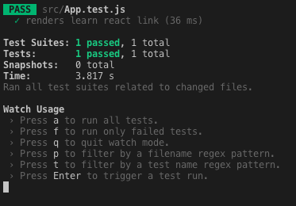

This blog post is a first approach to learn how to test React components. The goal is to provide a guide to get started in testing, understanding how the tests work and how we can run our first test in our React application.

##What is a test?

A test is a code that we write to verify the behavior of our application to ensure that works as intended. We need to constantly check and test our code to make sure that no gaps and errors exist.

Tests are frequently grouped by where they are added in the software development process, or by the level of specificity of the test. There are generally the following levels of testing:

- Unit Test: Verify that individual, isolated parts work as expected. The purpose is to validate that each unit of the software code performs as expected.

- Integration Test: Verify that several units work together

- E2E: Test the entire system. Kind of like a robot that simulates user behavior around the app and verifies that it functions correctly.

##Jest and React Testing Library

Jest is an open-source testing framework built on JavaScript.

A testing framework is an execution environment for automated tests. It is the overall system in which the tests will be automated. The testing framework is responsible for: defining the format in which to express expectations, executing the tests and reporting results.

React-testing-library is a library for testing React components in a way that resembles the way the components are used by end users. React-testing-library is not a testing framework, the library requires a framework and they recommend Jest. You can write unit and integration tests.

Projects created with Create React App come with Jest and React-testing-library configured.

##Understanding the react example test

When we create a React Application with create-react-app, we can find a file named `App.test.js` in our `src` folder. When opening that file we going to find the below code:

Full Example

```
import { render, screen } from '@testing-library/react';
import App from './App';

test('renders learn react link', () => {
render(<App />);
const linkElement = screen.getByText(/learn react/i);
expect(linkElement).toBeInTheDocument();
});
```

We are going to deconstruct this example to understand exactly how this test works

###Imports

At the top, we have import statements.

```
import { render, screen } from '@testing-library/react';
import App from './App';
```

We import two things from React Testing Library: A `render` function that will be used to render the component which we will be testing and a `screen` object that contains different methods to select elements in the document.

We also import the `App` component which we want to test.

###Test

After we are calling the `test` function which is a method provided by Jest

```
test('renders learn react link', () => {
render(<App />);
const linkElement = screen.getByText(/learn react/i);
expect(linkElement).toBeInTheDocument();
});
```

This method describes the test itself. It takes as parameters the `name` of the test, a `function` that holds the tests and timeout (optional) for specifying how long to wait before aborting.

```
test(name, function, timeout)
```

- name
  The name of the test in this case is “render learn react link”

- function

  ```
  () => {
  render(<App />);
  const linkElement = screen.getByText(/learn react/i);
  expect(linkElement).toBeInTheDocument();
  }
  ```

  We are going to made a detailed breakdown of this function:

  ```
  render(<App />);
  ```

  The `render` method renders a React element into the DOM.

  ```
  const linkElement = screen.getByText(/learn react/i);
  ```

  `getByText` can be used to search for all elements in the rendered virtual DOM that have a text node with text content matching the given regular expression. In the code example, this is used to check if the text “learn react” is contained anywhere in the virtual DOM rendered by the <App/> component.

  The `getByText` function accepts a string as input but also a regular expression. Whereas a string argument is used for the exact match, a regular expression can be used for a partial match which is often more convenient.

  ```
  expect(linkElement).toBeInTheDocument();
  ```

  expect: the condition that the test needs to pass.

  The `expect` function provided by Jest is used to make an assertion about this text being in the document.

  The method `toBeInTheDocument` of Jest’s expect function here is actually provided by another library that sits on top of React Testing Library, jest-dom.

##Running Tests

Now that we understand how the example test does, we need to learn to run it.

If you look inside the `package.json` file in your react project, you will find that there is a script for test.

```
"scripts": {
"start": "react-scripts start",
"build": "react-scripts build",
"test": "react-scripts test",
"eject": "react-scripts eject"
},
```

This means that you can run your tests typing:

```
npm run test
```

And finally you get the result of your test:


