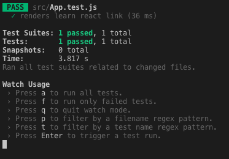

Este artículo es un primer acercamiento para aprender cómo realizar tests en componentes de React. El objetivo es proveer una guía de como comenzar a probar nuestras aplicaciones, entendiendo como funcionan los tests y cómo podemos ejecutar nuestro primer test en nuestra aplicación de React.

##Que es un test?

Un test es un código que escribimos para verificar el comportamiento de nuestra aplicación, para asegurarnos que funciona de acuerdo a como lo planeamos. Necesitamos constantemente revisar y probar nuestro código para asegurarnos que no existan brechas ni errores.

Los tests son frecuentemente clasificados por el momento del proceso de desarrollo en el que son agregados o por el nivel de especificidad del test. Generalmente existen los siguientes niveles de pruebas:

- **Test Unitario**: Verifican que las partes individuales funcionan como se espera. El propósito es validar que cada unidad de software funciona como se espera.

- **Test de Integración**: Verifican que varias unidades funcionan juntas.

- **E2E**: Prueban el sistema entero. Es como un robot que simula el comportamiento del usuario alrededor de la aplicación y verifica que funciona correctamente.

##Jest and React Testing Library

**Jest** es un framework de testing de código abierto hecho en JavaScript.

Un framework de testing es un entorno de ejecución para pruebas automatizadas. Es el sistema general en el que se automatizan las pruebas. El framework es responsable de: definir el formato para expresar las expectativas, ejecutar las pruebas y reportar los resultados.

**React-testing-library** es una librería para probar los componentes de React en una manera que se asemeja a la forma en que los usuarios finales usan los componentes. React-testing-library no es un framework de testing, es una librería que requiere un framework y recomiendan Jest. Puedes escribir pruebas unitarias y de integración.

Los proyectos creados con create-react-app vienen con Jest y react-testing-library configurados.

##Entendiendo el ejemplo de test de React

Cuando creamos una aplicación de React con create-react-app, podemos encontrar un archivo llamado App.test.js en nuestro folder src. Al abrir este archivo encontramos el siguiente código:

Ejemplo completo

```
import { render, screen } from '@testing-library/react';
import App from './App';

test('renders learn react link', () => {
 render(<App />);
 const linkElement = screen.getByText(/learn react/i);
 expect(linkElement).toBeInTheDocument();
});
```

Vamos a deconstruir este ejemplo para entender exactamente cómo funciona este test:

##Imports

En la parte superior, tenemos las declaraciones import:

```
import { render, screen } from '@testing-library/react';
import App from './App';
```

Importamos dos cosas de React Testing Library: Una función render que se usará para renderizar el componente que estaremos probando y un objeto screen que contiene diferentes métodos para seleccionar elementos en el documento.

También importamos el componente App que queremos probar

###Test

Después estamos llamando la función test, que es un método proporcionado por Jest:

```
test('renders learn react link', () => {
 render(<App />);
 const linkElement = screen.getByText(/learn react/i);
 expect(linkElement).toBeInTheDocument();
});
```

Este método describe la prueba en sí. Toma como parámetros el nombre de la prueba, una función que contiene las pruebas y el tiempo de espera (opcional) para especificar cuánto tiempo esperar antes de abortar.

```
test(nombre, funcion, tiempo-de-espera)
```

- **nombre:**
  El nombre de la prueba en este caso es “render learn react link”

- **función:**

  ```
  () => {
  render(<App />);
  const linkElement = screen.getByText(/learn react/i);
  expect(linkElement).toBeInTheDocument();
  }
  ```

  Vamos a hacer un desglose detallado de esta función:

  ```
  render(<App />);
  ```

  El método `render` renderiza un elemento React en el DOM.

  ```
  const linkElement = screen.getByText(/learn react/i);
  ```

  `getByText` se puede usar para buscar todos los elementos en el DOM virtual renderizado que tienen un nodo de texto con contenido de texto que coincide con la expresión regular dada. En el ejemplo de código, esto se usa para verificar si el texto "aprender a reaccionar" está contenido en algún lugar del DOM virtual representado por el componente <App />.

  La función `getByText` puede aceptar como entrada un string o una expresión regular. Mientras que se usa un argumento string para la coincidencia exacta, se puede usar una expresión regular para una coincidencia parcial que a menudo es más conveniente.

  ```
  expect(linkElement).toBeInTheDocument();
  ```

  expect: la condición que la prueba necesita pasar.

  La función `expect` proporcionada por Jest se utiliza para hacer una afirmación acerca de que este texto está en el documento.

  El método `toBeInTheDocument` de la función de expect de Jest aquí es en realidad proporcionado por otra librería que se encuentra en la parte superior de React Testing Library, jest-dom.

##Ejecución de Tests

Ahora que entendemos cómo funciona la prueba de ejemplo, debemos aprender a ejecutarla.

Si miras dentro del archivo `package.json` en tu proyecto de React, encontrarás que hay un script para test.

```
"scripts": {
"start": "react-scripts start",
"build": "react-scripts build",
"test": "react-scripts test",
"eject": "react-scripts eject"
}
```

Esto significa que puedes ejecutar tus pruebas escribiendo:

```
npm run test
```

Y finalmente obtienes el resultado de tu test:


<br/>

Espero que esta introducción a las pruebas en React pueda serte útil.
