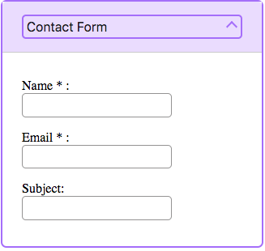

Regardless of the technology, framework or library in which we are working on, there are principles in which web development must be based. Undoubtedly accessibility is one of those.

As in the physical world, structures and buildings must be accessible to all people, in the digital world, the websites should be able to be used by as many people as possible.

Web accessibility depends on several components working together, including web technologies, web browsers,tools and websites.

In this order of ideas, each developer should aim to make their websites more inclusive and be aware there are people with permanent or temporary disabilities such as visual, hearing, mobility and cognitive impairments.

> “The power of the Web is in its universality.
> Access by everyone regardless of disability is an essential aspect.”
> Tim Berners - Lee

## Terms

There are some common terms when we talk about accessibility:

- **a11y** : is a numeronym( number-based word) for accessibility.

- **WAI**: The W3C Web Accessibility Initiative ([WAI](https://www.w3.org/WAI/)) develops standard and support materials to help you understand and implement accessibility.
  This organization developed the Web Content Accessibility Guidelines (WCAG) 1.0 and 2.0

- **WCAG**: Web Content Accessibility Guidelines defines how to make Web content more accessible to people with disabilities. The [WCAG](https://www.w3.org/WAI/standards-guidelines/wcag/) is separated into 3 levels of compliance, A, AA and AAA. Each level requires a stricter set of conformance guidelines

- **WAI-ARIA**(Accessible Rich Internet Applications): is a technical specification published by the World Wide Web Consortium (W3C) that specifies how to increase the accessibility of web pages.

## Basic Tips

Web accessibility is a very broad topic, but there are some basic considerations that we can take into account, to develop more accessible web content for people with disabilities.

### 1. Use semantic HTML

Making proper use of HTML elements is very important for web accessibility. This means using the correct HTML elements for their correct purpose as much as possible. When a screen reader, or an assistive device scans a web page, gets information about the HTML structure of the page.

For example, a button to download a file could be marked up like this:

`<div>Download </div>`

But its makes much sense to use the correct element `<button/>`, because not only have some style applied by default, it have built-in keyboard accessibility, it can be tabbed between and activated using Return/ Enter.

`<button>Download</button>`

We have to remember that when we write semantically correct HTML, we are allowing the browser to know what type of content it’s working with, and by doing this, we are opening the door to assistive technologies like screen readers to do their job.

### 2. Include alternative text for images

Images should include equivalent alternative text in the markup/code.

``


Adding alternative text to images allow that people with visual impairments navigating your site through assistive technologies.
The content of the alt attribute should provide a direct representation of the image. It should not include : “picture of” or “image of”, screen readers automatically announce an image as an image.

### 3. Provide meaning for non-standard interactive elements

Ideally, you should always use native HTML features to provide the semantics required by screen readers, sometimes this is not possible because you are creating something complex that doesn’t have an HTML element to implement it.
In such cases, WAI- ARIA can be a valuable accessibility tool.

WAI-ARIA is a specification written by the W3C, that define a set of additional HTML attributes that can be applied to elements to provide additional semantics and improve accessibility wherever it is lacking.

Below we can see how to use the WAI-ARIA attributes for a custom widget such as an accordion




```
<div id="accordionGroup" class="Accordion" data-allow-multiple>
    <h3>
      <button aria-expanded="true"
              class="Accordion-trigger"
              aria-controls="section1"
              id="contactForm">
        <span class="Accordion-title">
          Contact Form
          <span class="Accordion-icon"></span>
        </span>
      </button>
    </h3>
    <div id="section1"
         role="region"
         aria-labelledby="contactForm"
         class="Accordion-panel">
      <div>

        <fieldset>
          <p>
            <label for="name">
              Name*:
            </label>
            <input type="text"
                   value=""
                   name="Name"
                   id="name"
                   class="required"
                   aria-required="true">
          </p>
          <p>
            <label for="email">
              Email*:
            </label>
            <input type="email"
                   value=""
                   name="Email"
                   id="email"
                   aria-required="true">
          </p>
          <p>
            <label for="subject">
              Subject:
            </label>
            <input type="text"
                   value=""
                   name="Subject"
                   id="subject">
          </p>
        </fieldset>
      </div>
    </div>
    </div>
  </div>
```

The ARIA attributes can be divided into roles, states and properties. Below we can see the WAI-ARIA attributes used in the example:

#### Roles

Define what an element is or does. Examples: role=”navigation”, role=”complementary”, role=”banner”, role=”search”, role=”region”

| Role     | Usage                                                                           |
| -------- | ------------------------------------------------------------------------------- |
| `region` | Creates a landmark region that contains the currently expanded accordion panel. |

<br/>

#### Properties

Define properties of elements, which can be used to give them extra meaning or semantics

| Attribute                 | Usage                                                                                                      |
| ------------------------- | ---------------------------------------------------------------------------------------------------------- |
| `aria-required= “true”`   | Specifies that a form input needs to be filled in to be valid.                                             |
| `aria-controls="ID"`      | Points to the ID of the panel which the header controls.                                                   |
| `aria-labelledby="IDREF"` | Allows you to put an ID on an element, then reference it as being the label for anything else on the page. |

<br/>

#### States

Special properties that defines the current conditions of elements. The difference between properties and states, is that states can change throughout the lifecycle on an app.

| Attribute              | Usage                                                                     |
| ---------------------- | ------------------------------------------------------------------------- |
| `aria-expanded="true"` | Set to true when the Accordion panel is expanded, otherwise set to false. |
| `aria-disabled="true"` | Specifies to a screen reader that a form element is currently disabled.   |

<br/>
