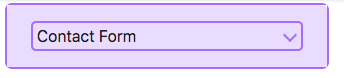

Sin importar la tecnologia, framework o libreria en la cual estamos trabajando, hay principios en sobre los cuales el desarrollo web debe estar basado. Sin duda la accesibilidad es uno de esos.

Así como el mundo fisico, las estructuras y edificios deben ser accesibles a todas la personas, en el mundo digital, los sitios web deberian poder ser usados por el mayor número de personas como sea posible.

La accesibilidad web depende de varios componentes que trabajan juntos, incluidas las tecnologías web, navegadores, herramientas y los sitios web.

En este orden de ideas, cada desarrollador debe tratar de hacer que sus sitios web sean más inclusivos y tener en cuenta que hay personas con discapacidades permanentes o temporales, como impedimentos visuales, auditivos, de movilidad y cognitivos.

> “El poder de la Web esta en su universalidad.
> El acceso de todos, independientemente de la discapacidad, es un aspecto esencial"
> Tim Berners - Lee

## Terminos

Hay algunos terminos comunes cuando hablamos de accesibilidad:

- **a11y** : Es un numerónimo (palabra basada en números) para accesibilidad.

- **WAI**: Iniciativa de Accesibilidad Web de la W3C, que desarrolla estandares y materiales de soporte para ayudarte a comprender e implementar la accesibilidad.
  Esta organización desarrolla las Guías de Accesibilidad de contenido web (WCAG) 1.0 and 2.0.

- **WCAG**: Las guías de accesibilidad de contenido web definen como hacer el contenido web mas accesible para personas con discapacidad. La [WCAG](https://www.w3.org/WAI/standards-guidelines/wcag/)esta separada en 3 niveles de cumplimiento A, AA y AAA. Cada nivel requiere un conjunto más estricto de pautas de conformidad.

- **WAI-ARIA**(Accessible Rich Internet Applications): Es una especificación tecnica publicada por el Consorcio W3C que especifica como incrementar la accesibilidad de las páginas web.

## Tips Básicos

La accesibilidad web es un tema muy amplio, pero hay algunas consideraciones básicas que podemos tener en cuenta, para desarrollar contenido web más accesible para personas con discapacidades.

### 1. Uso de HTML semántico

Realizar un adecuado uso de los elementos HTML es muy importante para la accesibilidad web. Esto significa usar los elementos HTML correctos para sus própositos correctos tanto como sea posible. Cuando un lector de pantalla, o un dispositivo de asistencia escanea una página web, obtiene información sobre la estructura HTML de la página.

Por ejemplo, un botón para descargar un archivo podría ser marcado como esto:

`<div>Download </div>`

Pero tiene mas sentido usar el elemento correcto `<button/>`, ya que no solo tiene algo de estilo aplicado de manera predeteminada, sino que también tiene la accesibilidad incorporada al teclado, puede ser tabulado y activado mediante la tecla Return/Enter.

`<button>Download</button>`

Debemos recordar que cuando escribimos el HTML semánticamente correcto, estamos permitiendo al navegador conocer con qué tipo de contenido esta trabajando, y al hacerlo, estamos abriendo la puerta a tecnologías de asistencia como los lectores de pantalla para hacer su trabajo.

### 2. Incluir texto alternativo para imagenes

Las imágenes deben incluir el texto alternativo equivalente en el código.

``


Adicionar texto alternativo a las imágenes permite que las personas con impedimentos visuales naveguen por tu sitio a través de tecnologías de asistencia.

El contenido del atributo `alt` debe proveer una representación directa de la imagen. No debe incluir : "imagen de ", los lectores de pantallan automáticamente anuncian una imagen como una imagen.

### 3. Proporcionar significado a elementos interactivos no estándar

Lo ideal es que siempre utilices las caracteristicas HTML nativas para proporcionar la semántica requerida por los lectores de pantalla, a veces esto no es posible porque estas creando algo complejo que no tiene un elemento HTML para implementarlo.
En tales casos, WAI-ARIA puede ser una valliosa herramienta de accesibilidad.

WAI-ARIA es una especificación escrita por el W3C, que define un conjunto de atributos HTML adicionales que pueden ser aplicados a los elementos para proporcionar una semántica adiccional y mejorar la accesibilibilidad donde sea que falte.

A continuación podemos ver como usar los atributos WAI-ARIA para un widget personalizado como un acordeón




```
<div id="accordionGroup" class="Accordion" data-allow-multiple>
    <h3>
      <button aria-expanded="true"
              class="Accordion-trigger"
              aria-controls="section1"
              id="contactForm">
        <span class="Accordion-title">
          Contact Form
          <span class="Accordion-icon"></span>
        </span>
      </button>
    </h3>
    <div id="section1"
         role="region"
         aria-labelledby="contactForm"
         class="Accordion-panel">
      <div>

        <fieldset>
          <p>
            <label for="name">
              Name*:
            </label>
            <input type="text"
                   value=""
                   name="Name"
                   id="name"
                   class="required"
                   aria-required="true">
          </p>
          <p>
            <label for="email">
              Email*:
            </label>
            <input type="email"
                   value=""
                   name="Email"
                   id="email"
                   aria-required="true">
          </p>
          <p>
            <label for="subject">
              Subject:
            </label>
            <input type="text"
                   value=""
                   name="Subject"
                   id="subject">
          </p>
        </fieldset>
      </div>
    </div>
    </div>
  </div>
```

Los atributos ARIA puede ser dividos en roles, estados y propiedades. A continuación podemos ver los atributos WAI-ARIA usados en el ejemplo:

#### Roles

Define lo que un elemento es o hace. Ejemplos: role=”navigation”, role=”complementary”, role=”banner”, role=”search”, role=”region”

| Rol      | Uso                                                                                    |
| -------- | -------------------------------------------------------------------------------------- |
| `region` | Crea una región de referencia que contiene el panel de acordeón expandido actualmente. |

<br/>

#### Propiedades

Definen las propiedades de los elementos, las cuales pueden ser usadas para dar significado adicional o semántica.

| Atributo                  | Uso                                                                                                                               |
| ------------------------- | --------------------------------------------------------------------------------------------------------------------------------- |
| `aria-required= “true”`   | Especifica que una entrada de formulario debe completarse para que sea válida.                                                    |
| `aria-controls="ID"`      | Apunta al ID del panel que controla el encabezado                                                                                 |
| `aria-labelledby="IDREF"` | Te permite poner un ID a un elemento, y luego hacer referencia a él como si fuera la etiqueta de cualquier otra cosa en la página |

<br/>

#### Estados

Propiedades especiales que definen las condiciones actuales de los elementos. La diferencia entre las propiedades y estados, es que los estados pueden cambiar a través de los ciclos de vida en una app.

| Attributo              | Uso                                                                                                  |
| ---------------------- | ---------------------------------------------------------------------------------------------------- |
| `aria-expanded="true"` | Establezca en verdadero cuando el panel Acordeón esta expandido, de lo contrario establezca en falso |
| `aria-disabled="true"` | Expecifica a un lector de pantalla que el elemento esta actualmente deshabilitado                    |

<br/>
